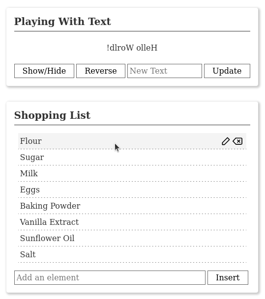

# Vue.js Demos

This is a collection of [Vue.js](https://vuejs.org/) demos I created during my work as a frontend
engineer in Japan. They were originally created using Vue.js 2, but have been updated to the latest
version 3 since. As they were meant to be simple demo projects, no further tooling besides a simple
web server is required to set them up.
The examples are styled using [Tachyons](https://tachyons.io/) and some icons from the
[Feather Icons](https://feathericons.com/) collection.


## Demo Contents

This repository is split into two separate projects, **vuejs-intro** and **dynamic-circles**.

**vuejs-intro** first showcases some really basic reactive features of Vue.js, such as displaying,
showing/hiding and reversing a user-editable message.
The second part then gets more interesting and implements a dynamic shopping/to-do list, featuring
working edit/delete buttons for each item and an input field to add new items to the list. This
example makes use of some more Vue.js features, such as components with properties (for the list
items), event handling (inserting and aborting input using the Enter/Escape keys, and deleting
items), a simple custom Vue directive to focus the input field when the edit button is pressed,
and input fields with a v-model to establish a two-way data binding for their values. I further
consider it an exercise in design, where I was striving for a simple, paper card-like appearance.



The second project, **dynamic-circles** picks up on this list and further expands it. It makes use
of [d3.js](https://d3js.org/) to dynamically render a list of circles. Circle radii can be inserted
into the list, edited, and deleted, with the drawing getting updated accordingly. Apart from
a simple example use case of d3.js, it makes use of another Vue.js feature, watchers, to
automatically trigger a redraw any time the list changes, and the "mounted" lifecycle hook to create
the initial drawing. Some basic error handling is also implemented to prevent the input of invalid
values into the list.

https://user-images.githubusercontent.com/9436392/211218951-cdfb9fca-d6b3-4f4e-acce-142d43cfec85.mp4

There are some minor caveats to this implementation: First, the modified value in the list does not
always correspond to the right circle in the image, leading sometimes to multiple circles to be
redrawn. Also, the image is resized immediately upon modification of the list, causing the animation
to be cut off if the largest circle gets deleted.


## Running the Demos

Simply spinning up a web server in the project folder is enough to view the examples.
There are multiple options available, for example:
```
$ python -m http.server 8080    #using Python's built-in HTTP server
$ http-server . -p 8080         #using npm's http-server (needs to be installed first)
```


## License

This work is dedicated to the public domain. You are free to use, copy, modify, and distribute it in
any way you like. While appreciated, an attribution is not required. See the UNLICENSE file for more
information.
Please note that this does not apply to the Feather icons included with this project, which are
licensed separately under the MIT license (see the LICENSE file in their respective folders).
